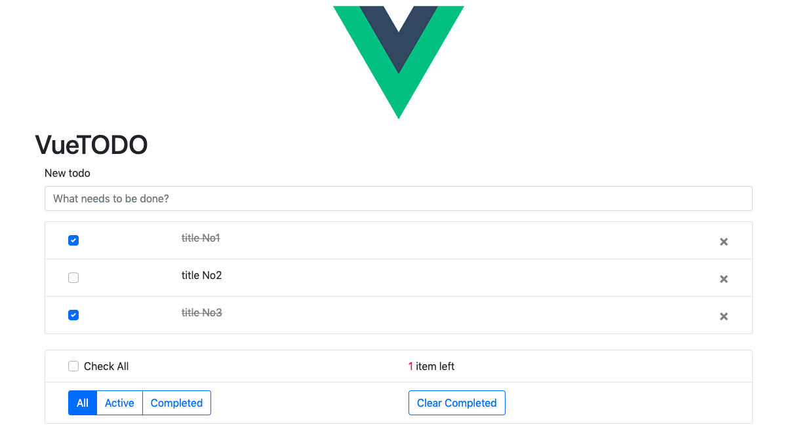

# vue rails api todo

## Demo

[heroku demo page](https://vue-rails-api-todo.herokuapp.com/)

## Screenshot



## Build with

- Ruby
- Ruby on Rails
- Vue
- Vuex
- PostgreSQL

## Development

you should run servers of Ruby on Rails and Webpack-dev-server of Vue

```
$ git clone git@github.com:youbeer/vue-rails-api-todo.git
$ cd vue-rails-api-todo
$ bundle install
$ rails db:migrate
$ rails db:seed
$ rails s
$ cd frontend
$ yarn install
$ yarn serve
```
